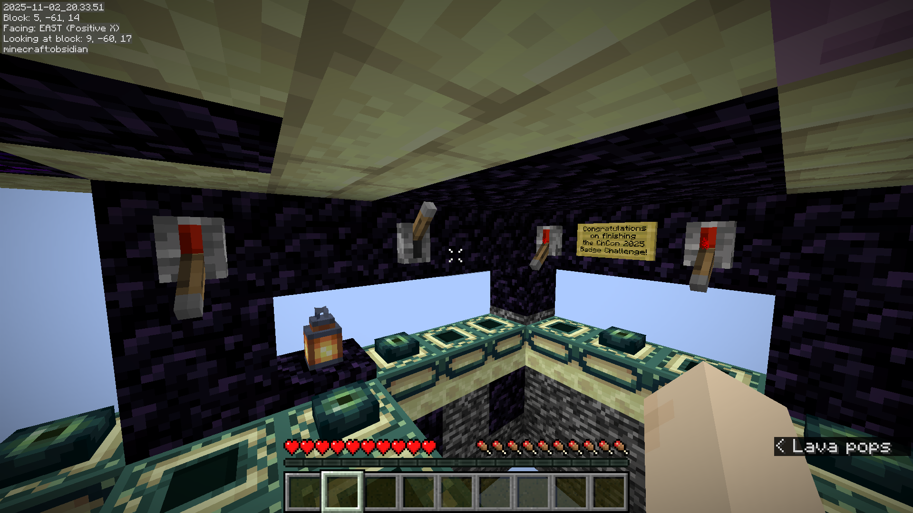

<h2> CHCon 2025 Badge Challenge </h2>

About the badge challenge for Christchurch Hacker Con 2025 [1].

Big shout out to NZ courier systems for holding the badge components until the day of the conference, causing everyone to end up with a blank badge for the first day.

Much more serious thanks to Jeremy and all the others who worked franctically to get all the badges assembled and put together for such a fun challenge!

<details><summary>Click here for excruciating detail on the badge challenge. Warning: <b>here be spoilers</b>!</summary>
<h3> What are we dealing with? </h3>
<h4> What can we see? </h4>

Visual inspection of the badge reveals a limited amount to my untrained eye:
- A USB-C port
- Some rows of pretty lights that turn on when plugged in to USB-C
- 2 tactile switches, hidden between the PCB and the main badge
- A microcontroller marked `ESP32-CR`:
- Smaller chips with a bunch of nerd letters that will end up being irrelevant.

From plugging it in, we can identify that the USB-C device is self-identifying as a JTAG header and has added a new device:

```
$ lsusb
Bus 001 Device 007: ID 303a:1001 Espressif USB JTAG/serial debug unit
...
$ ls /dev
ttyACM0
...
```

<h4> What does any of that mean? </h4>
<h5> JTAG </h5>

I'm familiar with what a JTAG header is - it's a debug interface that once I work out what I'm doing will give me a console to communicate with the device.

<h5> Microcontroller </h5>

Searching for `ESP32-C` tells me that I'm dealing with a Wi-Fi/Bluetooth SoC from Espressif [2,3] - this matches the JTAG advertisement, so far so good. Thanks to the nature of the console connection I won't end up needing this information - but it does prepare me for this device hosting a WiFi network.

<h5> BUTTONS! </h5>
Using a trusty butter knife, I discovered what the buttons do: one button restarts the device, and the other one changes the brightness level of the LEDs. This sounds like a nice feature - I found them to be a little brighter than I'd hoped. Unfortunately, this turned out to be the minimum setting, and the maximum setting is a viable replacement for my office light.

<h3> Getting a terminal </h3>
This can go one of two ways - we configure the JTAG header and do special JTAG communication using a tool called OpenOCD, or it's already happy for us to connect directly to it.

My preferred tool for serial connections is Minicom, so let's see what happens when we try and connect to the new device:
```
$ minicom -D /dev/ttyACM0
Welcome to minicom 2.8

OPTIONS: I18n 
Port /dev/ttyACM0, 16:07:17

Press CTRL-A Z for help on special keys

I (456) esp_image: segment 4: paddr=0019dba0 vaddr=40382214 size
                                                                Incorrect! Try again.

Enter passwordle: 
                  Incorrect! Try again.
```
Well that was easy. Restarting the connection to see what's going on, we don't get much other than the prompt `Enter passwordle:`. A little spamming later, we can identify the following:
- No failed-login timeout
- No obvious difference in console output between any basic response (including `passwordle`)

<h4> Overcomplicating things </h4>
Passwordle is an odd prompt to receive - I was expecting this prompt to behave like Wordle. A quick google search reveals there's an online game that does this - maybe the device wants today's answer?

```
⬜🟨⬜⬜⬜⬜⬜⬜⬜⬜⬜⬜
⬜🟨⬜⬜🟨⬜⬜⬜⬜⬜⬜⬜
🟩⬜⬜🟨⬜⬜⬜🟨⬜⬜⬜⬜
⬜⬜⬜⬜⬜⬜🟨⬜🟨⬜⬜⬜
🟩🟩⬜⬜⬜⬜⬜⬜🟨⬜🟨⬜
🟩🟩🟨🟩🟨🟨🟨🟨🟨⬜🟨⬜
🟩🟩🟨🟩🟨🟨🟨🟨⬜🟨🟨⬜
🟩🟩🟨🟩🟨🟨🟨🟨🟨🟨🟩⬜
🟩🟩🟩🟩🟨🟨🟩🟨🟨🟨🟩⬜
🟩🟩🟩🟩🟨🟩🟩🟩🟨🟨🟩⬜
🟩🟩🟩🟩🟩🟩🟩🟩⬜⬜🟩🟩
🟩🟩🟩🟩🟩🟩🟩🟩🟨⬜🟩🟩
🟩🟩🟩🟩🟩🟩🟩🟩🟩🟩🟩🟩
 5 @ B K A ) H 8 B 5 + X
```
So, we take our answer over to the device, and naturally we get: `Incorrect! Try again.` 

Did I put this in wrong? Clearly it's not accessing this site for a value. Thankfully, I quickly worked out what was going on:

<h4> Turn it over, dummy! </h4>
Something possessed me to flip the badge from its face-down position. Grinning back at me was something I should have expected: 

⬜⬜⬜⬜⬜⬜🟧⬜⬜⬜⬜⬜

With 12 lights along the top - one orange, and 11 white - we're back on the right track. We've demonstrated I have a rough understanding of wordle - time to do it again.
```
⬜🟧⬜⬜⬜⬜⬜⬜⬜⬜⬜⬜
⬜⬜⬜⬜🟧⬜⬜⬜⬜⬜⬜⬜
⬜⬜🟧🟧⬜⬜⬜⬜🟧⬜⬜⬜
⬜⬜⬜⬜⬜⬜⬜⬜⬜⬜⬜⬜
⬜⬜⬜⬜⬜🟧⬜🟧⬜⬜⬜⬜
⬜⬜🟧⬜⬜🟧⬜⬜⬜⬜⬜⬜
⬜⬜⬜⬜⬜🟧⬜⬜⬜⬜⬜🟧
🟩🟩🟧🟧🟧⬜⬜🟧🟧🟧🟧⬜
🟩🟩🟩🟩🟩🟩🟩🟩🟩🟩🟩🟩

INFO - Login completed on non-default mode, restoring previous mode
                                                                                                 INFO - Flash storage invalid, initializing with defaults


                           #######*
                         ########  #*#***
                        ####*  *#  #*******
         ####           ###*    ####****
         #########      #####**#######
       ################# ############
        ############################
         #################****######
    ######################******####
     ###################******#**##
    # #############********####**##
     ##  ##########***********##*##
        ############********##**##
        ##  #########*********###
       ####  ##################
      #  #####   ###########
         #####     #    #
          #  #   ##    #
           ##    ##   ###
                  #    #
                  ##   ##
                   #    #
                   #    #
                   ##   #######
                  #####   #####
                 ## ##  #   #


You solved the passwordle in 32 attempts, a new personal best!

Type 'help' for available commands
```
Well, lesson learnt - we'll keep the LEDs face-up from now on.

<h3> Using the terminal </h3>
<h4> What can we do? </h4>
It tells us to run `help`, so we do:

```
$ help
Available commands:
  help                      - Show this help message
  whoami                    - Show current user
  su                        - Switch to root user (requires password)
  led <mode>                - Control LED patterns
                              Type 'led' to see all modes
  pattern <cmd>             - Program custom LED patterns
    help                      Show programming guide
    new                       Enter new pattern (end with Ctrl-Z)
    run                       Activate custom pattern
    save <0-11>               Save pattern to slot
    load <0-11>               Load pattern from slot
    list                      List saved patterns
    clear-flash               Erase all saved patterns
  wifi [start <name> <pwd>] - Show/control WiFi AP
                              SSID: ChConBadge-<name>
  minecraft [start|stop]    - Show/control Minecraft server
  uptime                    - Show system uptime
  logout                    - Return to login screen
  reboot                    - Restart the device

$ whoami 
user

$ su
Password: ************
✗ Error: Authentication failed
✗ Error: Incorrect password
```
The login password isn't the su password (it was worth a shot), and we're not currently root. Despite that, we have a bit of leeway - we can start a Wifi AP, a Minecraft server, and mess with the LEDs (which I am absolutely going to do later).

I don't imagine minecraft supports connection via JTAG (much as that would be funny), so presumably the next steps here are to start the server and AP to connect to it. We can see that both are currently stopped:

```
$ minecraft

Minecraft Server:  Status              : Stopped

Start WiFi first with 'wifi start <name> <password>'

$ wifi

WiFi Status:  State               : Stopped
```

However, to start these we either need root access or to trick a root process into running these:
```
$ minecraft start 
✗ Error: WiFi must be running first. Use 'wifi start <name> <password>'

$ wifi start 
✗ Error: Permission denied: wifi start requires root access. Use 'su' to become root.
```
This leaves LED control as one of our only abilities - time to see how we can abuse that.

#### LEDs
Firstly, we're told that there's a handful of pre-programmed modes:
```
$ led 
Usage: led <mode>
Available modes:
  rainbow   - Cycling rainbow colors
  fire      - Animated fire effect
  matrix    - Matrix-style falling rain
  pulse     - Breathing color pulse
  scanner   - Knight Rider / Cylon scanner
  sparkle   - Random sparkle effect
  filmstrip - Smooth brightness wave
  waterfall - Blue cascade flowing down
  breathe   - Synchronized breathing
  snake     - Moving pixel with trail
  twinkle   - Coordinated star twinkling
  lava      - Flowing organic blobs
  lever     - Minecraft lever control
  wordle    - Password game feedback
```
Of these, we'll note the minecraft tie-in for later - but the rest are less exciting than the ability to program our own.

<details><summary>Click here for pattern help description</summary>

```
$ pattern help

=== Pattern Programming Guide ===

Create custom LED patterns using a stack-based language.
Your program executes once per LED (0-23) per frame.

A clumsy admin may have left their password on the stack.
== How the Stack Works ==
The stack holds values (0-255). Operations consume values from
the top of the stack and push results back.

Example: ADD pops two values, adds them, pushes result
  Stack: [5, 10]  ->  ADD  ->  Stack: [15]

== Stack Operations ==
  PUSH <val>    Push value (0-255) to stack
  DUP           Duplicate top: [a] -> [a, a]
  SWAP          Swap top two: [a, b] -> [b, a]
  POP           Remove top: [a, b] -> [a]
  POPN          Pop count, then pop that many more: [a, b, c, 2] -> [a]
  ROT           Rotate top 3: [a, b, c] -> [c, a, b]

== Arithmetic ==
All operations pop two values, push result:
  ADD           Pop b, pop a, push (a + b)
  SUB           Pop b, pop a, push (a - b)
  MUL           Pop b, pop a, push (a * b)
  DIV           Pop b, pop a, push (a / b)
  MOD           Pop b, pop a, push (a % b)
Note: Values wrap on overflow (0-255 range)

== Bitwise Operations ==
All operations pop two values, push result:
  AND           Pop b, pop a, push (a & b)
  OR            Pop b, pop a, push (a | b)
  XOR           Pop b, pop a, push (a ^ b)
  SHL           Pop b, pop a, push (a << b) - shift left
  SHR           Pop b, pop a, push (a >> b) - shift right
Tip: NOT can be done with: PUSH 255, XOR

== LED Operations ==
  SET_PIXEL     Pop B, G, R -> set current LED
  SET_LED <n>   Pop B, G, R -> set LED n (0-23)
  FILL          Pop B, G, R -> fill all LEDs
  HSV_TO_RGB    Pop V, S, H -> push R, G, B

== Pattern Helpers ==
  COUNTER       Push current counter (0-15, 1Hz, resets on 'pattern run')
  LED_INDEX     Push current LED index (0-23)
  SINE          Pop angle, push sine wave (0-255)

== Example 1: Scrolling Rainbow ==
  # Calculate hue based on LED position + animation
  COUNTER        # Push animation counter -> [counter]
  LED_INDEX      # Push which LED (0-23) -> [counter, led]
  ADD            # Add them -> [counter+led]
  PUSH 10        # Push multiplier -> [counter+led, 10]
  MUL            # Multiply -> [hue]
  # Convert HSV to RGB (full saturation & brightness)
  PUSH 255       # Saturation -> [hue, 255]
  PUSH 255       # Value -> [hue, 255, 255]
  HSV_TO_RGB     # Convert -> [R, G, B]
  SET_PIXEL      # Set current LED

== Example 2: Breathing Effect ==
  # All LEDs pulse together using sine wave
  COUNTER        # Get animation counter -> [counter]
  PUSH 4         # Slow down -> [counter, 4]
  DIV            # Divide -> [counter/4]
  SINE           # Get sine wave -> [brightness]
  DUP            # Copy for R -> [brightness, brightness]
  DUP            # Copy for G -> [b, b, b]
  FILL           # Fill all LEDs with RGB

== Example 3: Alternating Colors ==
  # Even LEDs red, odd LEDs blue
  LED_INDEX      # Get LED number -> [led]
  PUSH 2         # Push 2 -> [led, 2]
  MOD            # led % 2 -> [0 or 1]
  PUSH 255       # Max value -> [0/1, 255]
  MUL            # 0*255=0 or 1*255=255 -> [R]
  PUSH 0         # Green=0 -> [R, 0]
  PUSH 255       # Blue=255 -> [R, 0, 255]
  # Now R is 0 or 255, making red or blue
  SET_PIXEL      # Set the LED

== Example 4: Display 8 Bits Across 8 LEDs ==
  # Show each bit of 'A' (ASCII 65 = 0b01000001):
  PUSH 65        # Push letter 'A' -> ['A']
  LED_INDEX      # Pust current LED index ['A', led]
  SHR            # Shift A right by LED index: 'A' >> led -> [shifted]
  PUSH 1         # [shifted, 1]
  AND            # Extract bit 0 -> [0or1]
  PUSH 255       # Push 0xFF [0or1, 255]
  MUL            # Multiply 0xFF by 0or1 [0or255]
  DUP            # Duplicate value [bright, bright]
  DUP            # Duplicate valude [bright, bright, bright]
  SET_PIXEL      # Set the pixel, 255,255,255 or 0,0,0
  # Result: LEDs 0,6 ON (bits 0,6 of 'A' are 1)

Ready to create? Type 'pattern new' to start!
```

</details>

Well that's convenient. The pattern help tells us we only have to memory-overflow into the stack - I was worried this part would be too technical for me. Much as the other parts are exciting, I chose to get right to reading the stack - before I write buggy LED code that wipes it out.

We can use Example 4 pretty heavily here - this is all copied from example 4, without the part that pushed a letter onto the stack first:

```
# Adapted for existing stack state: [stk_bottom, ..., stk_top]
LED_INDEX       # Push current LED index [..., stk_top, led]
SHR             # Right-shift top by index (stk_top >> led) -> [..., shifted]
PUSH 1          # Prepare for AND [..., shifted, 1]
AND             # Only care about bit 0 (shifted & 1) [..., 0/1]
PUSH 255        # For magnitude [..., 0/1, 255]
MUL             # Create large diff between possible values [..., 0/255]
DUP             # [..., R, G]
DUP             # [..., R, G, B]
SET_PIXEL       # Either 255,255,255 or 0,0,0 [...]
# We can repeat this pattern until the stack is empty.
```

Using `pattern run` to apply this until the stack is empty keeps giving us the same value over and over, so the stack must be getting reset with each run. While this means we actually can't break the stack with a mistake, it does require adding a loop to the program:

```
# I'm guessing the stack gets reset on each frame?
COUNTER
POPN
# <code from above>
```

And this succeeds. Watching the LEDs, we cycle through the below patterns at 1/second:

```
⬜⬛⬛⬛⬛⬜⬛⬛
⬛⬛⬜⬛⬛⬜⬜⬛
⬛⬜⬛⬛⬜⬜⬜⬛
⬜⬛⬛⬛⬛⬜⬜⬛
⬛⬜⬛⬜⬜⬜⬜⬛
⬜⬛⬛⬜⬛⬜⬜⬛
⬜⬜⬜⬛⬜⬛⬜⬛
⬜⬜⬛⬜⬛⬜⬜⬛
⬜⬜⬛⬛⬛⬜⬜⬛
⬜⬛⬛⬛⬛⬜⬜⬛
⬛⬛⬜⬛⬜⬜⬜⬛
⬜⬜⬛⬛⬜⬛⬜⬛
# i.e. in binary
00100001
01100100
01110010
01100001
01111010
01101001
01010111
01101011
01100011
01100001
01110100
01010011
```
The more astute among you may notice that this I've reversed the binary - this is because we can expect to look for ASCII, in which characters primarily start with 011 or 010.

This translates to a reasonable string, but reversed. We know that we're reading from the top of the stack (the last thing added) first, so we should be trying this backwards from how it was output - the way that reads as a normal string. Sure enough:

```
$ su
Password: ***********
✓ Authentication successful
You are now root
```

<h3> The Minecraft Server </h3>
`help` isn't giving us anything new, so we'll see what we can accomplish using the minecraft server now that we have permissions for it.

```
$ wifi start octoscorp ********
Starting WiFi access point...
  SSID                : ChConBadge-octoscorp
  Password            : (protected)
✓ WiFi started successfully
  Clients can connect to: ChConBadge-octoscorp
  Badge IP: 192.168.4.1

INFO - DHCP server started - assigning IPs from pool

$ minecraft start 
Starting Minecraft server...
INFO - Saving storage to flash at 0x3F0000
                                          INFO - Storage saved successfully
                                                                           ✓ Minecraft server started!
  TCP Port            : 25565
  WebSocket Port      : 8080
  LED Mode            : Lever (Minecraft control)
  Players can now connect!

INFO - Starting WebSocket Minecraft server on port 8080...
                                                            INFO - Web clients can connect via ws://192.168.4.1:8080
                                                                                                                    INFO - Waiting for WebSocket client connec
tion on port 8080...
                    INFO - Starting Minecraft server on port 25565...
                                                                     INFO - Players can connect with Minecraft 1.21.4!
                                                                                                                      INFO - Waiting for Minecraft client conn
ection on port 25565...
```

I struck a fun bug here, where the act of a minecraft client "pinging" the server to see if it could connect would cause a panic:

```
$ INFO - Player connected!
                          INFO - Received 21 bytes, total: 21
                                                             INFO - Parsed packet! Consumed 19 bytes, state: Handshake
                                                                                                                      INFO - Buffer now has 2 bytes remaining


========================================
!!! CUSTOM PANIC HANDLER CALLED !!!
========================================
panicked at src/minecraft_server_simple.rs:572:59:
                                                  range start index 2 out of range for slice of length 0
========================================
Resetting device in 1 second...
========================================

Triggering software reset NOW
```

Thankfully, this is avoidable by using "Direct Connect" instead of adding it as a server.

Connecting via the vanilla connection just didn't want to play nice for some reason. Noticing the line above about a websocket connection, I installed the WSMC mod [4] to connect via websockets - et voila!


We spawn into a world with a small level in it. Based on the led pattern `lever` (which is automatically entered when the server starts), it's a pretty good guess that we're looking for levers. Sure enough, immediately on finding and flicking one, an LED on the badge lit up.

The remainder of the challenge is just a matter of running around the map, flicking all the levers to light up all the LEDs. It's certainly fun, but doesn't add much to the writeup.



</details>


## References and Spooky (External) Links

[1] https://2025.chcon.nz/

[2] https://docs.espressif.com/projects/esp-packaging/en/latest/esp32s3/01-marking/index_chip.html

[3] https://documentation.espressif.com/esp32-c3_datasheet_en.pdf

[4] https://github.com/deathcap/wsmc